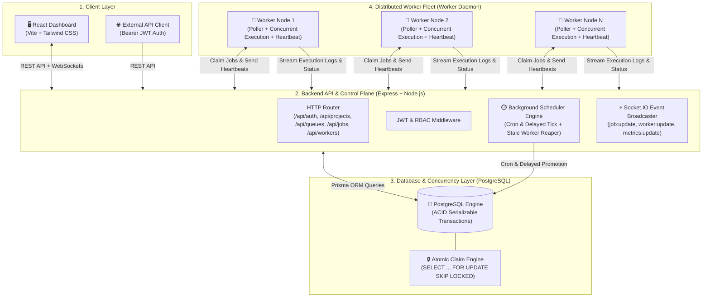
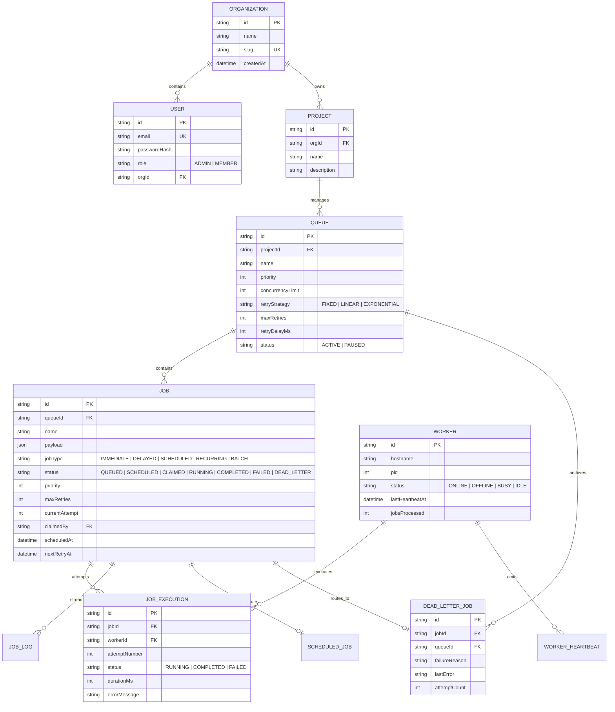
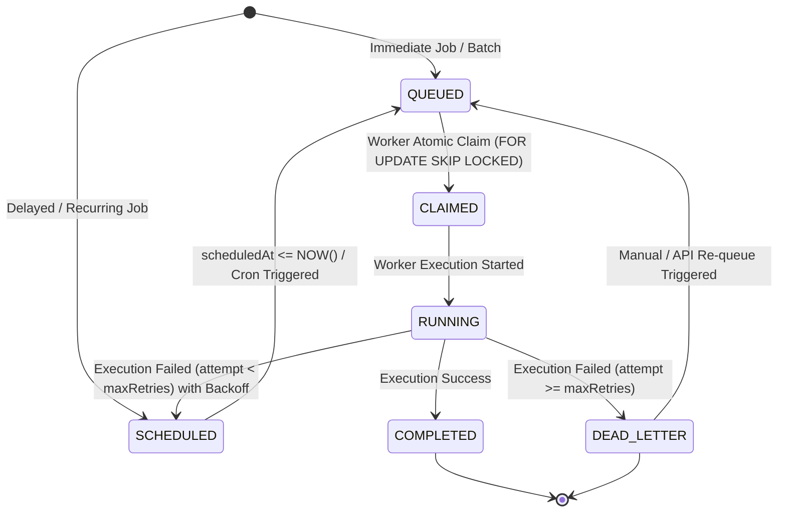

# System Architecture & Technical Specifications

## 1. System Overview
The **Distributed Job Scheduler** is a decoupled, multi-tier background execution engine built with **Node.js, Express, TypeScript, PostgreSQL (via Prisma), Socket.IO, and React**.

The platform is designed to:
1. Allow web clients to push compute-heavy or delayed tasks asynchronously.
2. Execute tasks concurrently across multiple autonomous worker nodes.
3. Guarantee that each job is processed exactly once without race conditions or duplicate claims.
4. Provide real-time operational visibility through WebSockets.

---

## 2. Architecture Diagram

---

## 3. Component Details

### A. Backend API Layer (`backend/src/`)
- **Control Plane:** Handles project management, queue configuration (concurrency, retry policies, priorities), job ingestion (immediate, delayed, scheduled, batch), and DLQ inspection.
- **Scheduler Engine (`scheduler.service.ts`):** 
  - Ticks every 5 seconds.
  - Promotes `SCHEDULED` jobs whose `scheduledAt <= NOW()` to `QUEUED`.
  - Evaluates cron expressions for recurring jobs and schedules the next run.
  - Heartbeat monitor: flags workers without heartbeats for >45s as `OFFLINE` and safely re-queues orphaned jobs.
- **Real-Time Gateway (`socket.service.ts`):** Emits status updates, worker health, and log streams to subscribed browser clients.

### B. Distributed Worker Service (`worker/src/`)
- **Autonomous Poller (`poller.ts`):** Polls active queues respecting queue priority and concurrency limits.
- **Atomic Claiming (`job.repository.ts`):** Calls PostgreSQL `FOR UPDATE SKIP LOCKED` inside a serializable transaction to claim jobs with zero locks/conflicts.
- **Execution Pipeline (`executor.ts`):** Executes task logic, streams live execution logs to the API, measures runtime `durationMs`, and handles error bubbling.
- **Heartbeat Emitter (`heartbeat.ts`):** Emits heartbeats every 5s containing worker PID, active job IDs, and processed job counts.
- **Graceful Shutdown:** Intercepts `SIGINT` / `SIGTERM`, deregisters from the backend API, and allows in-flight jobs to finish cleanly.

---

## 4. Entity-Relationship (ER) Schema

---

## 5. Job Lifecycle State Machine

