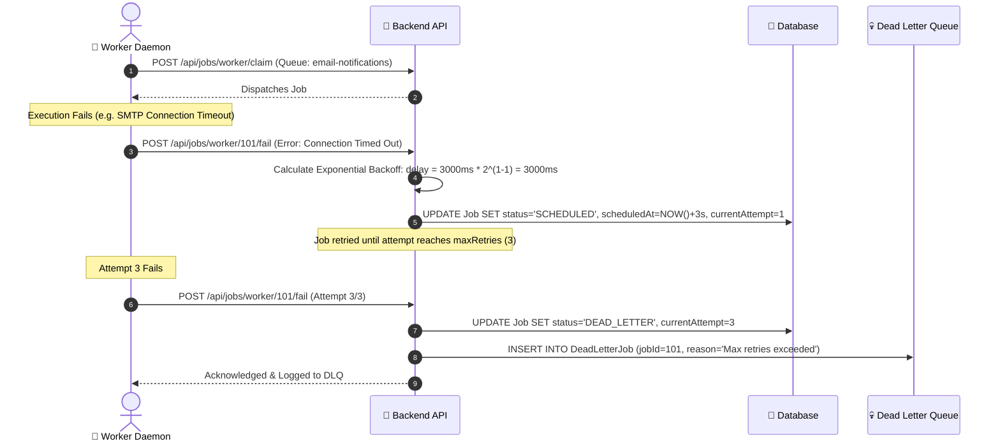
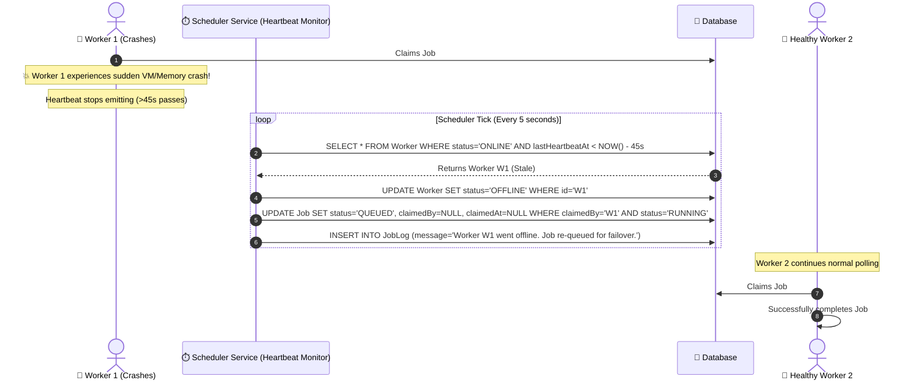

# Design Decisions & Engineering Trade-Offs

This document explains the technical rationale, design patterns, and engineering trade-offs made during the implementation of the **Distributed Job Scheduler**, illustrated with visual sequence and comparison diagrams.

---

## 1. Concurrency & Locking: PostgreSQL `FOR UPDATE SKIP LOCKED` vs Redis / BullMQ

### The Challenge
When multiple worker daemons poll the same queue concurrently, the system must guarantee that:
1. No two workers ever claim the same job (**Mutual Exclusion**).
2. Workers do not block or wait on locked rows (**Zero Contention / Starvation**).
3. The claim operation is resilient to database transaction rollbacks.

### Architectural Comparison

```mermaid
sequenceDiagram
    autonumber
    actor W1 as 👷 Worker 1
    actor W2 as 👷 Worker 2
    participant DB as 🐘 PostgreSQL (FOR UPDATE SKIP LOCKED)

    Note over W1, W2: Both workers poll at the exact same millisecond
    
    par Worker 1 Request
        W1->>DB: BEGIN TX; SELECT * FROM Job WHERE status='QUEUED' ORDER BY priority DESC LIMIT 1 FOR UPDATE SKIP LOCKED;
        activate DB
        DB-->>W1: Returns Job #101 (Locked)
        W1->>DB: UPDATE Job SET status='CLAIMED', claimedBy='W1' WHERE id=101; COMMIT;
        deactivate DB
    and Worker 2 Request
        W2->>DB: BEGIN TX; SELECT * FROM Job WHERE status='QUEUED' ORDER BY priority DESC LIMIT 1 FOR UPDATE SKIP LOCKED;
        activate DB
        Note over DB: Skips Job #101 because it's locked by W1
        DB-->>W2: Returns Job #102 (Locked)
        W2->>DB: UPDATE Job SET status='CLAIMED', claimedBy='W2' WHERE id=102; COMMIT;
        deactivate DB
    end

    Note over W1, W2: Result: Zero collision, Zero waiting, Exact-Once Claiming!
```

### Options Considered
- **Option A: Redis / Redlock / BullMQ**
  - *Pros:* High throughput in-memory queue.
  - *Cons:* Adds another infrastructure dependency, lacks native relational ACID guarantees with the main business database, complex data consistency management when jobs fail or require relational history.
- **Option B: Application-Level Distributed Mutex**
  - *Pros:* Language-level locking.
  - *Cons:* Prone to split-brain scenarios across distributed instances; fails if an instance crashes while holding the lock.
- **Option C: PostgreSQL `FOR UPDATE SKIP LOCKED` (Chosen)**
  - *Pros:* Built directly into PostgreSQL ACID engine. The query selects the highest-priority, oldest `QUEUED` job and immediately locks the row. Any other concurrent worker running the exact same query automatically **skips** the locked row and claims the next available job without blocking.
  - *Implementation:* Verified under 10 concurrent worker processes racing for 1 job in `tests/concurrency/atomic_claim.test.ts` (100% mutual claim isolation verified).

---

## 2. Retry Strategies & Exponential Backoff Math

### Failure & DLQ Sequence Flow



### Formulations Implemented:
1. **`FIXED` Delay:**
   $$\text{Delay} = \text{baseDelayMs}$$
2. **`LINEAR` Backoff:**
   $$\text{Delay} = \text{baseDelayMs} \times \text{attemptNumber}$$
3. **`EXPONENTIAL` Backoff:**
   $$\text{Delay} = \text{baseDelayMs} \times 2^{(\text{attemptNumber} - 1)}$$

---

## 3. Worker Node Failover & Stale Worker Reaping

### Failover Sequence Flow



---

## 4. Relational Database Design & Indexing Strategy

### Index Optimization:
To support sub-millisecond polling and high throughput, composite indices were designed for hot query paths:
- `@@index([status, queueId, priority])`: Crucial for worker job claim queries (`WHERE queueId = ... AND status = 'QUEUED' ORDER BY priority DESC, createdAt ASC`).
- `@@index([nextRetryAt])` & `@@index([scheduledAt])`: Crucial for the background scheduler tick queries.
- `@@index([claimedBy])`: Optimizes worker failover and reaping operations.

### Multi-Tenancy & Data Isolation:
- `Organization -> Project -> Queue -> Job` hierarchy ensures strict organization-level data isolation in all REST endpoints via JWT middleware.
